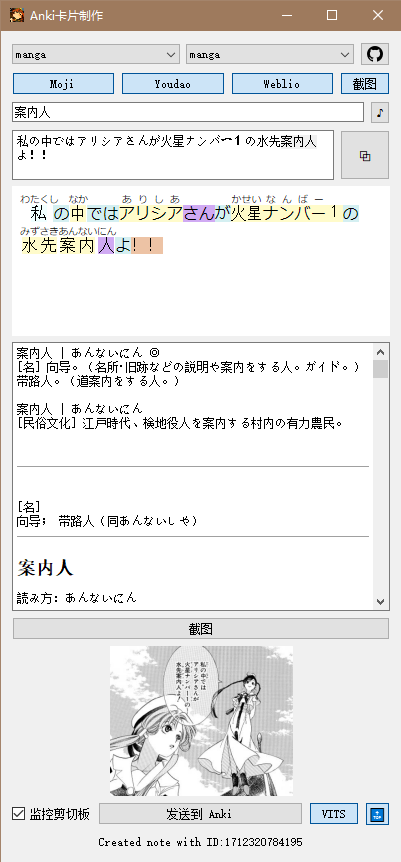

## 如何开始
部署：
```bash
git clone https://github.com/raindrop213/anki-scene-memory.git
pip install -r requirements.txt
```

Anki:
- 在 [Anki](https://apps.ankiweb.net/) 安装 [AnkiConnect](https://ankiweb.net/shared/info/2055492159) 
- 导入我准备的 [Anki模版](anki_template/manga_test.apkg)

语音TTS：
- 来自项目 [vits-simple-api](https://github.com/Artrajz/vits-simple-api)
- 为了方便，这里有我打包好的两个版本 [整合包CPU(0.8G)](https://github.com/raindrop213/LunaTranslator-re/releases/download/v0.0.1/vits-simple-api-windows-cpu-v0.6.9_vits-uma-genshin-honkai.rar) / [整合包GPU(1.96G)](https://github.com/raindrop213/LunaTranslator-re/releases/download/v0.0.1/vits-simple-api-windows-gpu-v0.6.9_vits-uma-genshin-honkai.7z)（包含[zomehwh发布的804个语音模型](https://huggingface.co/spaces/zomehwh/vits-uma-genshin-honkai)）

Mecab：
- 下载[unidic词典(774MB)](https://cotonoha-dic.s3-ap-northeast-1.amazonaws.com/unidic-3.1.0.zip)（词典的数据托管于 AWS 开放数据赞助计划。您可以[在此处](https://aws.amazon.com/jp/blogs/news/published-unidic-mecab-on-aws-open-data/)阅读公告）
- 解压到files文件夹中

设置：
- 按需修改config.yaml（注意看Mecab中unidic词典的路径对不对）
- 一般分为manga和novel两种模式，可自由更改牌组和牌模板，区别在于还有是否发送截图。

(其他可选) OCR：
- [manga-ocr](https://github.com/kha-white/manga-ocr) 截图并识别日文

## 漫画模式
https://github.com/raindrop213/anki-scene-memory/assets/53202747/8d717951-9753-4cac-917e-036c6b082eb5

## 小说模式
https://github.com/raindrop213/anki-scene-memory/assets/53202747/47bd47f5-9f69-4f10-a206-ae49dc51c3de

## 注意
- 可能您已经看出问题了，毕竟是ai，正确是<ruby>案内人<rt>あんないにん</rt></ruby>，vits读错了，在这里放个例子，重点还是要看词典的读音，请以weblio为准，有道moji发音都经常出错的。
- 漫画是我用 [mokuro](https://github.com/kha-white/mokuro) 提取的ocr文字，只是方便点(点击复制是我自己加的，给动手能力强的抛砖引玉)，错误还是偶尔会有的，漫画还是请用 [manga-ocr](https://github.com/kha-white/manga-ocr) + [snipaste](https://zh.snipaste.com/) 来识别吧，这完全够用了
- 语音我这打包了一个整合包：[vits-simple-api_gpu_v0.5.3_anon.7z](https://github.com/raindrop213/AnonTranslator/releases/download/v0.4.1/vits-simple-api_gpu_v0.5.3_anon.7z)（1.73G）
- 这个anki-scene-memory整合包还在打包中，晚点发




